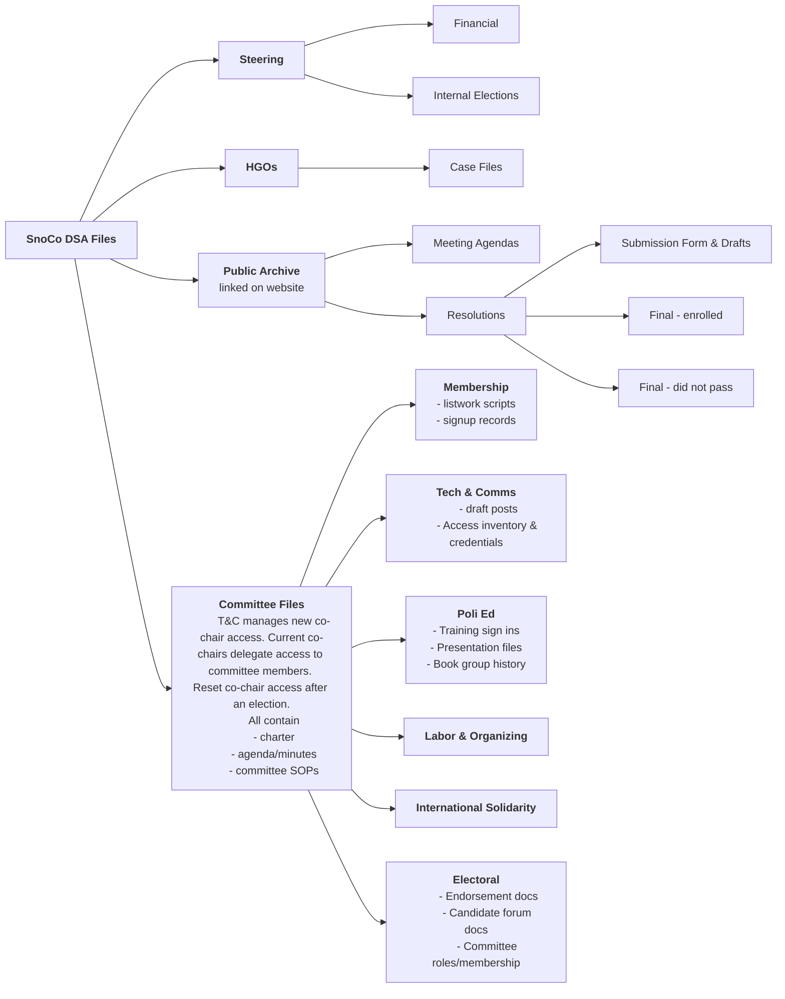

```mermaid
flowchart LR
    All["`**SnoCo DSA Files**`"] --> Steering["`**Steering**`"]
    Steering --> C[Financial]
    Steering --> D[Internal Elections]
    All --> HGO["`**HGOs**`"]
    HGO --> F[Case Files]
    All --> Public["`**Public Archive**
    	linked on website`"]
    Public --> H[Meeting Agendas]
    Public --> I[Resolutions]
    I --> J[Submission Form & Drafts]
    I --> K[Final - enrolled]
    I --> L[Final - did not pass]
    All --> Committee["`**Committee Files**
    	T&C manages new co-chair access. Current co-chairs delegate access to committee members. Reset co-chair access after an election.
    	All contain
  	- charter
    	- agenda/minutes
    	- committee SOPs`"]
    Committee --> N["`**Membership**
        - listwork scripts
    	- signup records`"]
    Committee --> O["`**Tech & Comms**
    	- draft posts
   	- Access inventory & credentials`"]
    Committee --> P["`**Poli Ed**
    	- Training sign ins
    	- Presentation files
    	- Book group history`"]
    Committee --> Q["`**Labor & Organizing**`"]
    Committee --> R["`**International Solidarity**`"]
    Committee --> S["`**Electoral**
    	- Endorsement docs
    	- Candidate forum docs
    	- Committee roles/membership`"]
```
